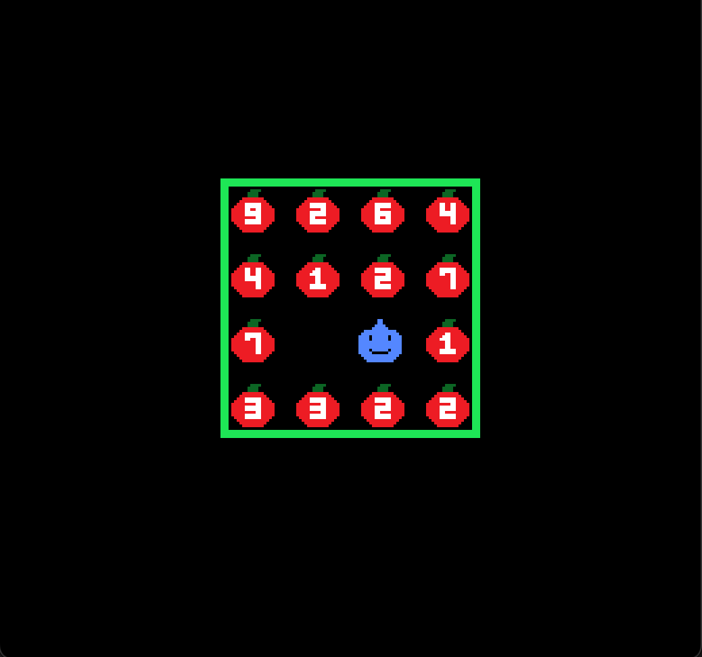

# Prime Apples

Author: Daniel Zeng

Design: \
This game is essentially the [fruit box game](https://en.gamesaien.com/game/fruit_box/) but you get to control someone around the grid. There is an additional twist in that you can hold a max of 5 apples and when you eat, it has to sum up to a prime number.

Screen Shot: 

How Your Asset Pipeline Works: \
All pixel art was created by me on https://www.pixilart.com. I wrote a python script to map each pixel of an image to two bit maps that followed the PPU466 specification. From there, since I chose to use 16 x 16 images, I split the bit maps up into four parts and printed the code to a text file to copy over to PlayMode.cpp. All files used for the Asset Pipeline can be found in the `assets/` directory.

How To Play: \
Use the arrow keys to move left, right, up and down. Use the space bar to consume apples you're currently holding. The goal is to eat as many apples in 30 seconds while making sure the sum of the apples you eat with each space bar is a prime number. You cannote hold more than 5 apples at a time and if you eat a nonprime value of apples, you die.

Notes: \
It's slightly buggy in that if you hold down an arrow key, the update function sometimes isn't called correctly and the overlap function isn't called as a result.
\
In hindsight, I could have made the apples take up space in the background which would allow me to place a lot more than 15 apples.

This game was built with [NEST](NEST.md).

